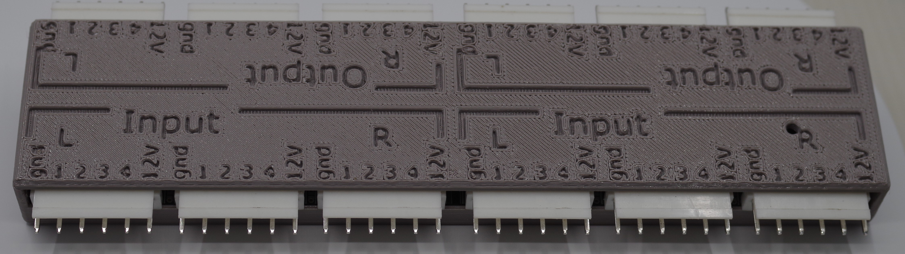
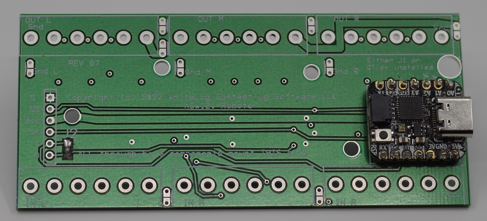
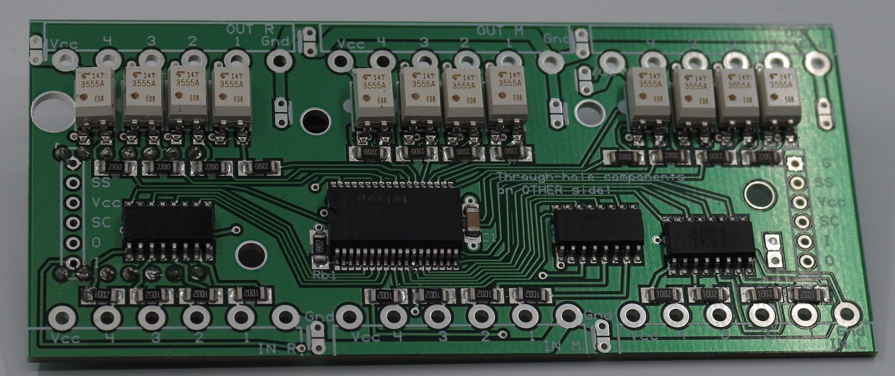

ASW12V

Remote controllable multi-channel AC/DC switch 
ASW12V: antenna switch for 12V

My shack has a number of 12VDC controlled circuits for antennas. When
I am sitting at the operating position, they are
 controlled by rotary switches there. 
When connected to the station remotely using WriteLog, I need a way to 
control the switches from the shack PC. This device is a USB controlled
solid state multi-channel AC/DC switch. While its named "12V" it can
safely switch up to a maximum of 60V AC or DC, and at up to about 3A. The remainder of
this document uses "12V" to describe the power supply, even though the PCB
is more capable.

In the absence of 
control commands over its USB serial port input,
its output channels follow its input channels. USB power on the 
USB-C plug is required to power the embedded microprocessor for it to
follow its inputs.

This device is controlled by ASCII command strings sent over
its USB serial port. WriteLog is not required to operate it,
but a WriteLog plugin is posted <a href='W5XD-antennas'>here</a> showing 
how to embed
antenna switching commands for this hardware
within WriteLog. The example has on-screen controls corresponding
to the antennas at W5XD. Full source code is published.

The power and ground are optically isolated on both input and output side, and separately,
into groups of four channels. Each group of four has its own power and ground terminals.
All the input and output power and ground circuits are optically isolated
from the USB power and ground as used by the Arduino controller on the PCB.

 This documentation is for Revision 8 of the ASW12V. Previous revisions of this design used 
PNP darlington output devices that are out of production.

Here is the 24 channel version built with screw terminals:

The longest dimension is about 8in (21cm). The short dimension is about 4in (10cm). The other 
12 channel enclosure is half as wide (4" x 4" or 10cm x 10cm). 
Here is a populated PCB before connectors are installed. the SMD components are all on the "bottom" of the PCB
and the connectors and QTpy controller (which are through-hole) are installed on the "top".

Top and bottom are in quotes because when the SMD components are installed, they must be on  the
top of the PCB in the oven. But when the full device is assembled and in operation, the SMDs are on the bottom.

 

Power and Ground

The PCB layout has three sections each with four input/output channels and with grounds and
VCC isolated to that section. In the photo above, all the G and 12V connections are, without installing any jumpers,
 isolated from each other. Solder jumpers on the PCB enable interconnects among them. See below.
 The power and ground circuit is this:
<a href='ASW12V-circuit3.pdf'>ASW12V-circuit3.pdf</a>. 
Many different power supply options are supported by jumper options on the PCB for exactly what Ground and 
VCC connections are interconnected on
the PCB. One thing that is not optional: fuse at about 3A or otherwise current limit the connection from the
 power supply to the Vcc terminal on the ASW12V. The ASW12V PCB has components too dense to service. Plan on
 replacing it if it is damaged by over current.
 
You can successfully use this device with NONE of these jumpers in place. But consider how you want to use it.
In my own case, the same 12VDC supply powers all my antenna relays, so I can safely tie all the Gnd and VCC
terminals together. Your shack may differ.

The PCB has jumpers that can internally connect:

<ol>
<li>the VCC pin to the VCC on the adjacent section.
<li>the OUTPUT GND pin to the OUTPUT Gnd pin of the adjacent section.
<li>the INPUT Gnd pin to the OUTPUT Gnd pin of the section.
<li>the INPUT GND pin to the INPUT Gnd pin of the adjacent section.
 </ol>
 The positions of the jumpers are hand-outlined on this <a href='ASW12V-bottom.pdf'>bottom view of the PCB silkscreen</a>. 
 The jumpers are most easily installed (and removed) on the bottom side of the PCB. The jumpers corresponding to (1) and (2) are at the top of the picture, 
 the ones for (4), the INPUT to INPUT, are at the bottom and the ones for (3) are between.
 
 The circuit board traces are wide enough
 to suppoart a total of 3A to the VCC and GND connectors on each terminal block.
 
Construction

A parts list, construction details, and a PCB layout are published <a href='construction.md'>here</a>.
 

Inductive Loads

The solid state relays do not have built-in protection from any inductive voltage spike that happens as
an inductive load is turned off. The PCB has 12 positions for diodes to be installed, labeled D11 up through D44.
Installing these diodes is optional. They are not needed for non inductive loads, nor for inductive loads that have
their own flyback diodes installed (e.g. the Array Solutions 6-Pak in my shack.)

Controlling the ASW12V

A USB connection to the USB-C connector is required for operation of the microcontroller. Without USB power, all outputs are
off. The sketch on the Arduino powers up
in a pass through mode. That is, the firmware transfers the INPUT
side as a pass through to the OUTPUT&mdash;a signal on an INPUT pin results in Vcc applied to corresponding OUTPUT pin on
the opposite side of the box.

When plugged in to a computer, the drivers for its USB port automatically are installed (on most
 operating systems) and create a virtual serial port. An example program to write useful serial commands is published <a href='W5XD-antennas'>here on github</a>. The example
is specific to the antennas to be controlled at W5XD. It doesn't put much on the screen. as not much is required at W5XD.

Control the beverages, one to the RX antenna on each of two radios:

Control the main transmit antenna, one of 6 to each of two radios:

All the buttons on the two windows above can be programmed as keyboard shortcuts in WriteLog.

Enclosures

This repository publishes a design for an enclosure a 24 channel device (with 2 PCBs) with connectors installed on the PCB.
 The 3D designs were done with <a href='solidedge.com'>Solid Edge</a>. 
The PCB hole pattern accommodates either the screw terminals or the connector. The
Solid Edge models are in the CAD folder. The 3D printable parts are published in the <a href="STL/">STL</a> directory. Unfamiliar with 3D design 
and printing? Don't be bashful about clicking the <a href="STL/">STL</a> link and the enclosure models. 

I use a <a href='http://prusa3d.com'>prusa3d</a> printer.
 
