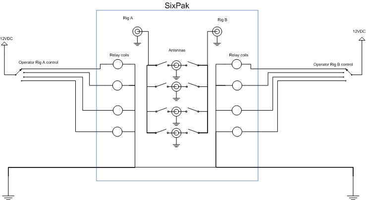
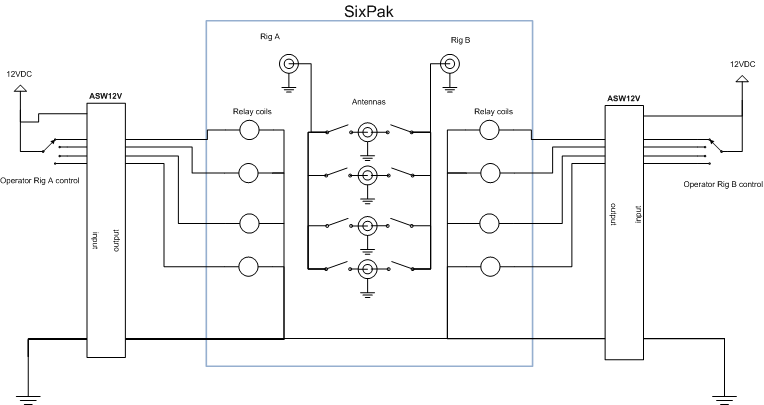

Antenna switch control for station W5XD

This is a .NET application for controlling the antenna switching at W5XD.
It serves as an example of both how an ASW12V might be used,
and how to split a WriteLog keyboard shortcut processor between control-site
and remote-site.

My station has these items to control:
<ul>
<li>Four beverage antennas (receive only) that each can be switched into the RX antenna port of either of two rigs. The
 rigs are called "primary" and "secondary" because my relay circuit.</li>
only routes each beverage to one rig at a time, and the primary radio always wins when both controls are switched 
    to the same direction.</li>
<li>A 12VDC supply for remote tuner (MFJ-998RT). That tuner can be commanded to find a better match by cycling its power off then back on.</li>
<li>Antennas switched with an Array Solutions <a href='https://www.arraysolutions.com/antennas-switching/sixpak-so'>SixPak</a></li>
</ul>

Also at W5XD, the operator tends to run WriteLog for his logging software (funny thing
about that.) Beverages really need to be switched from within the contest logging program
with just a keystroke. This is important when trying to pull a weak signal out of the noise at the same time as typing the CALL.
(For this particular function, its really not an effective computer/user interface to
change the keyboard focus outside the logging program and then back.)

That beverage-switching problem is why this .NET application is structured to build both 
a .exe (to run standalone) and a .NET assembly.
When you open this Visual Studio solution, W5XD-antennas.sln, you build both. If you run the exe standalone 
you get control over the ASW12V,
but not from within WriteLog. Instructions for using the assembly within WriteLog are below. 

Here is a picture of how the ASW12V gets wired into the control circuits for the SixPak. (The
beverage controls are not shown here. They are similar with the exception of having only four positions
on the control switches.)
Before installing the ASW12V, the SixPak controls are wired this way:

(SixPak internal circuit here is only representative. I omit its safety latches, and 
show only four of the six channels.) Just cut the control cable between the operator position and the relay box and wire in the ASW12V:

For simplicity in the diagram I show the control cables split at
two ASW12V boxes. But in my shack, both control cables are routed through
just one ASW12V. And its the 24 channel version. The beverage
and tuner power switching are all routed to the same terminal blocks
and all controlled using one virtual COM port.
 

The diagram shows that power and ground are connected on the INPUT side of the ASW12V.
If your load exceeds about 1A (of the 3A maximum rating) then
wire the heavier power and ground leads to the power source on the OUTPUT side of the
ASW12V to avoid overloading the internal (and smaller) INPUT to OUTPUT power and ground jumper traces.

To use within WriteLog, place a copy of the W5XD_antennas_shortcuts.dll in WriteLog's Program directory,
and make a new entry in WriteLog.ini. WriteLog can then access the beverage switching from
keyboard shortcuts. The INI entry looks like this:
<pre><code>
[ExternalShortcuts]
W5XD_antennas_shortcuts.WriteLogKeyProcessor=W5XD_antennas_shortcuts</code>
</pre>
WriteLog doesn't need the .exe file. Only the .dll need be installed in WriteLog's Program folder. To get the antenna controller on the screen assign any (or all) of its four shortcuts to keyboard keys, then invoke one.

<h3>WriteLog Remote Control</h3>
WriteLog as of its version 12.36 supports keyboard shortcut processing split across
the control-site to the remote-site. This project shows how to accomplish that
in its .NET source code. The Writelog.ini setting at the remote site is as above, but at the control site,
you need this entry instead:
 <code>W5XD_antennas_shortcuts.WriteLogKeyProcessorControlSite=W5XD_antenna_shortcuts</code>
 
