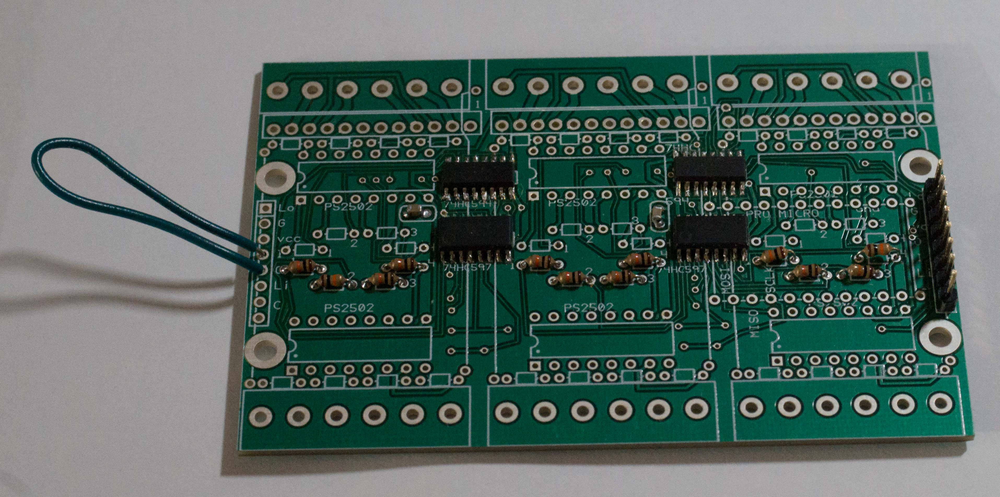

ASW12V Construction
    <h3>Parts lists</h3>
    The parts of the device can all&mdash;except the PCB&mdash; be obtained at digikey: <a href="partslist.pdf">partslist.pdf</a>.
    Or here is a link to the equivalent digikey shared shopping cart:
    <a href="https://www.digikey.com/short/pc7jpw">https://www.digikey.com/short/pc7jpw</a>.

The printed circuit board is a four layer part. It is not commercially available.
    It was laid out with <a href="http://expresspcb.com">expresspcb</a> from the
    file ASW12V.rrb. Or you may use the gerber
    files in the <a href="gerber">gerber</a> folder. As of this writing the gerber files
    are for PCB Revision 2 (not revision 3 as in ASW12V.rrb.) Rev 2 has narrower V+ and GND traces on its
    OUTPUT jack and is therefore limited to 1A among its outputs.
    The Revision 3 of the PCB is limited to 3A among its outputs.
 
 Program an Arduino Pro Micro with the sketch published in <a href="sketch//ASW12V">sketch/ASW12V/</a>.
    <h3>Construction Recommendations</h3>
The PCB layout is tight which does not make for easy maintenance. The
        very tight clearances mean that once all the big parts
        are installed, it is essentially impossible to
        service the small ones. If, for example, lightning damages this
        board, do not expect to service it. Expect to throw it away
        and build another.
    
Install <i>only</i> these parts and stop:
<ol type="a">
    <li>
        the four surface mount shift registers at U1, U2, U3, and U4. To solder an SMT 16 pin IC, start by
        soldering two opposite corner pins to their pads. Check that pin 1 is where it belongs. Check alignment.
        Check alignment again. Then solder all 16 pads.
    </li>
    <li>the two .33uF power supply bypass capacitors. The PCB has holes but the parts list
    specifies an <code>0805</code> sized SMT part. It can be soldered across the holed pads. Or substitute a through-hole part.</li>
    <li> a male header at J1.</li>
</ol>
Also install male headers on your Pro Micro and then
use
<ol type="a">
    <li> 7 jumpers to temporarily wire it to the PCB</li>
    <li>
        jumper the I to O pins at J2. I use a solder wire
        for the I to O, which can later be cut in the middle
        to jumper to the next board, if there is one.
    </li>
</ol>
Your board should look like this, minus the 10K resistors I have already placed:

<h3>Shift Register Digital Test</h3>
You need a serial port terminal program connected to
the Arduino&#8217;s serial port for the following tests. I recommend
<a href="https://www.chiark.greenend.org.uk/~sgtatham/putty/latest.html">putty.exe</a>.
Click its "Serial" button in its upper right to put it in serial port terminal mode.
<ol>
    <li>
        Test that the
        <code>d</code> command correctly tells you there  is one board in the daisy chain.
    </li>
    <li>
        Test the
        <code>n</code> command. Ignore the results from Sent 1, 2 and 3
        but confirm that <code>Sent 4 Got 0</code>, <code>Sent 5 Got 1</code> and counting up
        from there.
    </li>
</ol>

Do <b><i>not</i></b> install any more parts until the above two tests succeed.

<h3>Digital Input Test</h3>
Install only the 3 banks of 10K resistors on the input
shift registers. Now your board will match the photo above.
They are labeled 1, 2, 3, and 4 on each
of the 3 banks. These are the ones just above the input
optoisolators. Install the ODD numbered ones first, solder
and trim the leads. Then install the EVEN numbered ones.
The circuit board clearances are minimal and installing
in this order makes it easier to avoid solder bridges.
    
Type the <code>i</code> command while using a test lead to
short these adjacent pins of the input optoisolators:
<ul>
    <li>16 to 15 (gives a "1" in the corresponding <code>i</code> command)</li>
    <li>14 to 13 (gives a "2"...)</li>
    <li>12 to 11 (gives a "4"...)</li>
    <li>10 to 9 (gives "8").</li>
</ul>
There are 12 input signals to verify.
Do <b><i>not</i></b> install any more parts until this test works.
    
<h3>Digital Output Test</h3>
   
Install the 3 banks of 3.3K resistors on the output
shift registers. They are labeled 1,2,3, and 4, and are
the ones just below the output optoisolators.

Use the <code>n</code> command to make the outputs count up.
The fastest bank is the right. The slowest bank
is left. The fastest pin is 1. The slowest pin is 4
The HIGH output is Vcc for the Pro Micro you are using:
either 3.3V or 5.0 V.

Now you can populate the parts on the rest of the board.

The GND and VCC jumpers on the PCB, if needed, are most easily installed from the <a href='ASW12V-bottom.pdf'>bottom</a>.

<h3>Enclosure</h3>

The enclosure is documented in the <a href="CAD/">CAD</a> and <a href='STL/'>STL</a> folders.
The mounting posts have channels that fit #4 machine nuts. Square nuts are easier to
place, but hex nuts work as well. In either case, clean out the 3D printing debris before
pushing a nut in the channel. And put a small piece of tape over the opening after the nut
is placed because gravity is going to try to remove it.  
