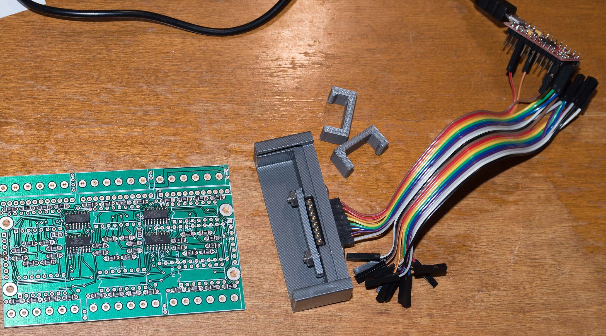

ASW12V Construction
<h3>Parts lists</h3>
The parts of a 12-channel, single-PCB device can all&mdash;except the PCB and enclosure&mdash; be obtained at digikey:
<a href="partslist.pdf">partslist.pdf</a>.
Or here is a link to the equivalent digikey shared shopping cart:
<a target="_blank" href="https://www.digikey.com/short/tr1t8r3d">https://www.digikey.com/short/tr1t8r3d</a>.

The digikey references above do <b>not</b> include the necessary input/output screw terminals or connectors. The PCB design accommodates 
either of these connector configurations:

<ul>
<li><a target="_blank" href='https://www.digikey.com/short/z8zprc'>Phoenix Contact 1935200 </a>. (screw terminals) 
OR
<li><a target="_blank" href='https://www.digikey.com/short/z8zprj'>TE Connectivity AMP Connectors part 1744048-6</a>. (male pins on plug.)
This plug mates with these parts:
<ul>
<li><a target="_blank" href='https://www.digikey.com/short/z8zprb'>mating housing</a>
<li><a target="_blank" href='https://www.digikey.com/short/z8zprd'>crimp pins</a>
</ul>
</ul>

The parts lists above also do <b>not</b> include the board-to-board connectors you'll need to 
interconnect the two PCBs if you build the 24 channel version:

<ul>
<li><a target="_blank" href='https://www.digikey.com/short/z8prdt'>Right angle connection header, male</a>. </li>
<li><a target="_blank" href='https://www.digikey.com/short/zp42fr'>Right angle connection header, female</a>. </li>
<li>Double all the quantities in the parts list above.</li>
</ul>

If you're going to build several of these in a batch, here is a handy <a href='https://www.digikey.com/short/zp4253'>part</a>. 
It can be used with a jig (which you'll have to design and build) to jumper any Arduino (of any size)
 to test a partially 
populated PCB. See the testing instructions <a href='#TestJig'>below</a>.

The printed circuit board is a four layer design. You must have them built.
It was designed with <a target="_blank" href="http://expresspcb.com">expresspcb</a> and the
file is ASW12V.rrb. 
<ol>
<li>This repository maintains only the most recent PCB revision's documentation in the master branch. Look for tags to find documentation of older revisions.</li>
<li>Revision 8 uses Solid State Relay outputs, the QTpy Arduino device, and the MAX7301 i/o extender. Its the
smallest form factor of all the revisions.</li>
<li>Revision 6 accommodates the pinout of the more readily available STA402 10-pin SIP PNP darlington, and 
adds 2 Amp SMD size <code>1206</code> flywheel diodes to accommodate inductive loads (which includes, for example, a relay coil!) The 
SMA4021 part for earlier PCBs has built-in flywheel diodes.
<li>Revision 5 is identical to Revision 6, but its gerber file.top has been hand edited to remove a stray trace.
<li>Revision 4 adds pads for SMD <code>1206</code> size resistors while the through-hole positions remain an option. 
	Install one or the other. </li>
	<li>Revision 4 and earlier accommodate the SMA4021 12-pin SIP Darlington PNP with built-in flywheel diodes. </li>
<li>Revision 3 and later of the PCB is limited to 3A among its outputs.
Earlier revisions have lower current limits. Revision 3 and later of the PCB accommodates either of the above interconnects. </li>
</ol>
 
Program the Arduino QTpy with the sketch published in <a href="sketch//ASW12V">sketch/ASW12V/</a>. 

<h3>Construction Recommendations</h3>
    
Install <i>only</i> the SMD parts and stop to test:
<ol type="a">
    <li>You will need reflow solder oven.</li>
   <li>Place and bake all the SMD parts.</li>
</ol>
There is more than one way to test for solder bridges and/or pins that missed soldering. Choose a way to test
and verify the SMD components are working before soldering the Input and Output connectors. Its a lot harder to work
with the board with those connectors in place.

Possible hardware configurations for testing

All the jumpers on the PCB have through holes for a wire jumper, and also have solder pads on both the top
and the bottom so you can bridge a blob of solder across the jumper. This pad configuration is on all of them: 
the I to O jumper at J2, the GND
jumpers and both of the Vcc jumpers.
<ol>
<li>Install the QTpy on the PCB (<b>notice it goes on the opposite side of the board from the SMD parts!</b>) 
OR</li>

<li>Install male headers on your QTpy and then use
<ol type="a">
    <li> 6 jumpers to temporarily wire it to the PCB. I used these jumpers from 
<a href='http://www.sparkfun.com/products/10898'>sparkfun</a>.</li>
    <li>If this test is for a board that will have the QTpy controller, then 
    you may install a sacrificial header now at J1.
A vertical header (straight pins) will work, but if you don't know where you're going to
    install this board, then install a right angle header as if it will not be the first board (i.e. one without
a QT py). If it ever is to become the first board,
    you'll have to cut all the pins off the header for mechanical clearance. But by then they'll not be needed.</li>
    <li>
        jumper the I pin to the O pin at J2. A jumper is required for the last board in the chain
both for testing and for normal operation. A right angle female header
	is required at J2 for any board that has another beyond it. 
In either case, for initial test, install this jumper. 
    </li>
    <li>The jumper list from J1 to the Arduino:
    <ol type='1'> 
        <li>SS to the slave select pin (named M7301_SELECT) in the Arduino sketch</li>
        <li>G to either pin GND</li>
        <li>vcc to Vcc. (The MAX7301 is OK up to 5V, but will be run at 3.3 V once the QTpy is installed)</li>
        <li>O to the SPI MISO pin</li>
        <li>I to the SPI MOSI pin</li>
        <li>SC to the SPI SCK pin</li>
    </ol>
    </li>
</ol>
</li>
<ol>

Or if you're building more than one of these at a time, A test jig might come in handy. 
There is no need to
commit to a particular set of headers because the spring loaded connector holds well enough to test with 
jumper leads per these
photographs. 

The photos above are for REV05 of the PCB. I did not design jigs for the REV08 PCB
because its easy enough to solder the QTpy directly to the board.

<h3>Shift Register Digital Test</h3>
You need a serial port terminal program connected to
the Arduino&#8217;s serial port for the following tests. I recommend
<a href="https://www.chiark.greenend.org.uk/~sgtatham/putty/latest.html">putty.exe</a>.
Click its "Serial" button in its upper right to put it in serial port terminal mode. You will also need a DVM to 
accomplish these tests. The tests are easier to do if you buid the sketch with 
<pre><code>#define DBG_PRINT 1</code>
</pre>
<ol>
    <li>
        Test that the
        <code>d</code> command correctly tells you there is one board in the daisy chain.
    </li>
    <li>
        Test the
        <code>I</code> command (which is only available with DBG_PRINT set). 
    </li>
</ol>

Do <b><i>not</i></b> install any more parts until the above two tests succeed. 

<h3>Digital Input Test</h3>

Type the <code>i</code> command while using a test lead to, one at a time,
short these adjacent pins on each of the <i>input</i> optoisolators (also one at a time):
<ul>
    <li>16 to 15 (prints out a "1" in the corresponding <code>i</code> command)</li>
    <li>14 to 13 (prints out a "2"...)</li>
    <li>12 to 11 (prints out a "4"...)</li>
    <li>10 to 9 (prints out "8").</li>
</ul>
There are 12 input signals to verify. Do <b><i>not</i></b> install any more parts until this test succeeds.
    
<h3>Digital Output Test</h3>
   

Use the <code>C</code> command to clear the internal test state, and then repeatedly
use the <code>t</code> command to assert each channel in the daisy change, right most to left
with the board top-up and the silk screen lettering right-side-up.
The HIGH output is Vcc for the Arduino you are using: either 3.3V or 5.0 V.

Add the connectors <b><i>only</i></b> after you verify each of the outputs.

<h3>12V output section test</h3>
The SSR outputs respond to a DVM ohmmeter set to beep on low resistance. Verify that
ONLY the one SSR output shows continuity between its output pin and its Vcc pin.
<ul>
<li><code>m 1 L0F</code> <i>turns OFF all the L outputs</i>
<li><code>m 1 L1F</code> <i>turns ON only the L 1 output</i>
<li><code>m 1 L2F</code> <i>turns ON only the L 2 output</i>
<li><code>m 1 L4F</code> <i>turns ON only the L 3 output</i>
<li><code>m 1 L8F</code> <i>turns ON only the L 4 output</i>
</ul>

For the <code>L</code>, substitute <code>M</code> when 
testing the middle section and <code>R</code> when testing the right section.

The GND and VCC jumpers on the PCB, if needed, are most easily installed on the <a href='ASW12V-bottom.pdf'>bottom</a>. There is a discussion about why you would or would not install the jumpers in the main <a href='README.md'>README</a>.

<h3>Enclosure</h3>

The enclosure is documented in the <a href="CAD/">CAD</a> and <a href='STL/'>STL</a> folders.
The mounting posts on the enclosure top have channels that fit #4 machine nuts. Square nuts are easier to
place, but hex nuts work as well. In either case, clean out the 3D printing debris before
pushing a nut in the channel.  And put a small piece of tape over the opening after the nut
is placed because gravity is going to try to remove it while you do the remainder of the assembly.  

Quantity 4 by 3/4 (or 5/8) inch machine screws are needed per section to fasten the top to the bottom.

The mounting screw holes in the enclosure bottom can be cleared of print debris by pushing a
#4 machine screw through from the inside toward the outside.

